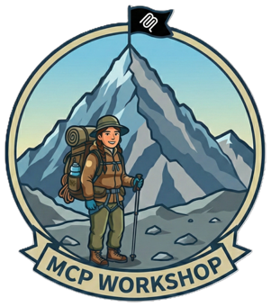

---
hide:
  - navigation
  - toc
---

<div class="hero-banner">
  <div class="hero-banner-content">
    <div class="hero-banner-text">
      <div class="hero-badge">AZURE-SAMPLES / Workshop</div>
      <h1>MCP Security <span class="hero-accent">Workshop</span></h1>
      <p>See what Model Context Protocol enables. Understand exactly why each capability must be locked down. Hands-on exploitation and remediation using Azure-native security.</p>
      <div class="hero-banner-buttons">
        <a href="#workshop-modules" class="md-button md-button--primary">Explore the Modules</a>
        <a href="prerequisites/" class="md-button">Prerequisites</a>
      </div>
    </div>
    <div class="hero-banner-image">
      
    </div>
  </div>
</div>

## Why This Workshop

<div class="grid cards" markdown>

-   :material-eye:{ .lg .middle } __Capability First__

    ---

    Each module opens by showing what MCP enables — then demonstrates what goes wrong without security controls.

-   :material-shield-check:{ .lg .middle } __Azure-Native Security__

    ---

    Entra ID, Key Vault, API Management, AI Content Safety, and Log Analytics — production services, not toy demos.

-   :material-book-open-variant:{ .lg .middle } __OWASP-Aligned__

    ---

    Every technique maps to the [OWASP MCP Azure Security Guide](https://microsoft.github.io/mcp-azure-security-guide/) for industry-standard coverage.

</div>

---

## Workshop Modules { #workshop-modules }

Each module demonstrates a real MCP capability, exploits it without security controls, then applies the fix.

<div class="module-cards">

<a href="modules/base-module/" class="module-card">
  <div class="module-card-header">
    <span class="module-icon twemoji"><span class="material-icons">landscape</span></span>
    <strong>Module 0: Foundations</strong>
  </div>
  <p>What MCP exposes — tools, resources, and user data. See exactly what an unauthenticated server hands to anyone who connects.</p>
  <span class="module-tag">No Azure required</span>
</a>

<a href="modules/module1-identity/" class="module-card">
  <div class="module-card-header">
    <span class="module-icon twemoji"><span class="material-icons">shield</span></span>
    <strong>Module 1: Identity</strong>
  </div>
  <p>Cloud-deployed MCP servers accessed by AI clients. See credential theft in action, then fix it with OAuth 2.1, Managed Identity, and Key Vault.</p>
  <span class="module-tag">Authentication &middot; Authorization</span>
</a>

<a href="modules/gateway/" class="module-card">
  <div class="module-card-header">
    <span class="module-icon twemoji"><span class="material-icons">router</span></span>
    <strong>Module 2: Gateway</strong>
  </div>
  <p>Routing multiple MCP servers through a single entry point. Expose what happens without a gateway, then lock it down with APIM and Private Endpoints.</p>
  <span class="module-tag">Networking &middot; Governance</span>
</a>

<a href="modules/io-security/" class="module-card">
  <div class="module-card-header">
    <span class="module-icon twemoji"><span class="material-icons">verified_user</span></span>
    <strong>Module 3: I/O Security</strong>
  </div>
  <p>Natural language driving backend logic and returning sensitive data. Watch prompt injection and data exfiltration succeed — then stop them cold.</p>
  <span class="module-tag">Input validation &middot; Content safety</span>
</a>

<a href="modules/monitoring/" class="module-card">
  <div class="module-card-header">
    <span class="module-icon twemoji"><span class="material-icons">analytics</span></span>
    <strong>Module 4: Monitoring</strong>
  </div>
  <p>Full AI tool usage across your infrastructure. Build dashboards and alerts so attacks are never invisible again.</p>
  <span class="module-tag">Observability &middot; Alerting</span>
</a>

<a href="modules/module5-supply-chain/" class="module-card">
  <div class="module-card-header">
    <span class="module-icon twemoji"><span class="material-icons">verified</span></span>
    <strong>Module 5: Supply Chain</strong>
  </div>
  <p>Verify what you install before it runs. Scan dependencies, generate SBOMs, configure Dependabot, and enforce container scanning — the one layer that protects everything else.</p>
  <span class="module-tag">MCP04 &middot; Dependabot &middot; SBOM</span>
</a>

<a href="modules/summit/" class="module-card">
  <div class="module-card-header">
    <span class="module-icon twemoji"><span class="material-icons">checklist</span></span>
    <strong>Summary</strong>
  </div>
  <p>OWASP Top 10 coverage summary, production readiness checklist, and resources for going deeper.</p>
  <span class="module-tag">Summary &middot; Next steps</span>
</a>

</div>

---

## Quick Start

From clone to running lab in under ten minutes.

**1. Clone the repository**

```bash
git clone https://github.com/Azure-Samples/Workshop.git
cd Workshop
```

**2. Install dependencies & verify**

```bash
curl -LsSf https://astral.sh/uv/install.sh | sh
python --version  # 3.10+
az account show   # logged in
```

**3. Start at Module 0: Foundations**

Open the [Module 0 guide](modules/base-module.md) and follow along. The docs tell you when to deploy and test code from the repo.

!!! info "First time?"
    Check the **[Prerequisites](prerequisites.md)** for full setup instructions and system requirements. No security expertise required — if you can write Python and navigate the Azure Portal, you're ready.

---

## References

:material-book: [OWASP MCP Azure Security Guide](https://microsoft.github.io/mcp-azure-security-guide/) — Companion guide referenced throughout  
:material-file-document: [MCP Specification](https://modelcontextprotocol.io/specification/2025-11-25) — Official protocol documentation  
:material-github: [FastMCP Framework](https://github.com/jlowin/fastmcp) — Python framework used in this workshop

---

*MCP is a capability multiplier for AI. Every tool you expose is a potential attack surface. The labs in this workshop exist so that attack surface is never a surprise.* 🔒
